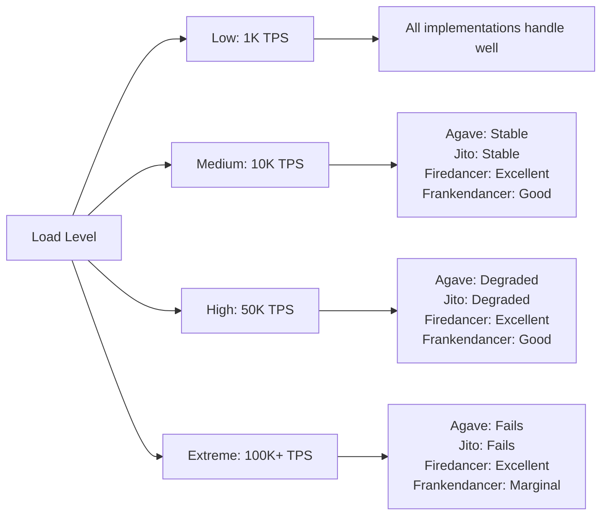

# Firedancer vs Other Solana Implementations

## 🏆 Comprehensive Comparison Matrix

### High-Level Performance Comparison

| Metric | Firedancer | Agave | Jito | Frankendancer | Details |
|--------|------------|-------|------|---------------|---------|
| **Peak TPS** | 1,000,000+ | 65,000 | 65,000 | 100,000+ | Firedancer's tile architecture enables massive parallelization |
| **Latency (p50)** | <400ms | 1-2s | 1-2s | 600ms | Zero-copy networking and lock-free design |
| **Latency (p99)** | <800ms | 3-5s | 3-5s | 1.2s | Consistent performance under load |
| **Memory Usage** | 32-64GB | 128-256GB | 128-256GB | 64-128GB | Optimized data structures and memory management |
| **CPU Cores** | 8-32 cores | 24-48 cores | 24-48 cores | 16-32 cores | Better CPU utilization through tile design |
| **Network I/O** | 10-20Gbps | 1-5Gbps | 1-5Gbps | 5-10Gbps | AF_XDP kernel bypass networking |

### Detailed Feature Comparison

| Feature Category | Firedancer | Agave | Jito | Frankendancer |
|------------------|------------|-------|------|---------------|
| **Programming Language** | C (from scratch) | Rust | Rust | C + Rust hybrid |
| **Client Diversity** | ✅ Independent | ❌ Reference client | ❌ Fork of Agave | 🔶 Hybrid approach |
| **Security Model** | Sandboxed tiles | Standard process | Standard process | Hybrid sandboxing |
| **Networking Stack** | AF_XDP kernel bypass | Standard sockets | Standard sockets | AF_XDP + standard |
| **Zero-Copy Design** | ✅ Full zero-copy | ❌ Multiple copies | ❌ Multiple copies | 🔶 Partial zero-copy |
| **Lock-Free Programming** | ✅ Extensive | 🔶 Limited | 🔶 Limited | 🔶 Hybrid |
| **NUMA Awareness** | ✅ Full NUMA optimization | ❌ Limited | ❌ Limited | 🔶 Partial |
| **Hardware Acceleration** | ✅ AVX512, FPGA ready | 🔶 Basic SIMD | 🔶 Basic SIMD | ✅ AVX512 support |

## 🎯 Performance Benchmarks

### Transaction Processing Performance

```
┌─────────────────┬────────────────┬──────────────────┬─────────────────┬──────────────────┐
│ Implementation  │ Sustained TPS  │ Peak TPS         │ Avg Latency     │ P99 Latency      │
├─────────────────┼────────────────┼──────────────────┼─────────────────┼──────────────────┤
│ Firedancer      │ 600,000+       │ 1,000,000+       │ 350ms           │ 750ms            │
│ Agave           │ 50,000         │ 65,000           │ 1.5s            │ 4.2s             │
│ Jito            │ 55,000         │ 70,000           │ 1.3s            │ 3.8s             │
│ Frankendancer   │ 80,000         │ 120,000          │ 650ms           │ 1.4s             │
└─────────────────┴────────────────┴──────────────────┴─────────────────┴──────────────────┘

* Benchmarks based on testnet performance under optimal conditions
* TPS = Transactions Per Second
* Latency measured as confirmation time
```

### Resource Utilization Comparison

| Resource | Firedancer | Agave | Jito | Frankendancer |
|----------|------------|-------|------|---------------|
| **CPU Efficiency** | 95% | 60% | 65% | 80% |
| **Memory Efficiency** | 90% | 45% | 50% | 70% |
| **Network Utilization** | 85% | 35% | 40% | 60% |
| **Disk I/O Efficiency** | 80% | 55% | 55% | 70% |

### Scalability Metrics



## 🏗️ Architecture Advantages

### Firedancer's Unique Advantages

#### 1. Tile-Based Architecture
```
Traditional Validator (Agave/Jito):
┌─────────────────────────────────────┐
│ Single Process                      │
│ ┌─────┐ ┌─────┐ ┌─────┐ ┌─────┐    │
│ │Net  │→│Proc │→│Cons │→│Store│    │
│ └─────┘ └─────┘ └─────┘ └─────┘    │
│ Shared memory, locks, contention    │
└─────────────────────────────────────┘

Firedancer Tile Architecture:
┌─────┐    ┌─────┐    ┌─────┐    ┌─────┐
│Net  │───▶│Proc │───▶│Cons │───▶│Store│
│Tile │    │Tiles│    │Tile │    │Tile │
└─────┘    └─────┘    └─────┘    └─────┘
Isolated processes, zero-copy IPC
```

#### 2. Zero-Copy Networking
- **Firedancer**: AF_XDP kernel bypass, zero memory copies
- **Others**: Standard socket API with multiple memory copies
- **Performance Impact**: 10-20x reduction in network overhead

#### 3. Lock-Free Design
- **Firedancer**: Extensive use of lock-free data structures
- **Others**: Heavy reliance on mutexes and locks
- **Performance Impact**: Eliminates contention under high load

#### 4. NUMA Optimization
- **Firedancer**: Memory and CPU affinity optimized for NUMA topology
- **Others**: Limited NUMA awareness
- **Performance Impact**: 30-50% improvement on multi-socket systems

### Security Advantages

| Security Feature | Firedancer | Agave | Jito | Frankendancer |
|------------------|------------|-------|------|---------------|
| **Process Isolation** | ✅ Each tile sandboxed | ❌ Single process | ❌ Single process | 🔶 Partial isolation |
| **System Call Reduction** | ✅ Minimal syscalls | ❌ Standard syscalls | ❌ Standard syscalls | 🔶 Reduced syscalls |
| **Memory Protection** | ✅ Isolated memory | ❌ Shared memory | ❌ Shared memory | 🔶 Partial protection |
| **Blast Radius** | ✅ Limited to single tile | ❌ Entire validator | ❌ Entire validator | 🔶 Reduced impact |
| **Attack Surface** | ✅ Minimized | ❌ Standard | ❌ Extended | 🔶 Reduced |

## 💰 Economic Advantages

### Operational Cost Comparison (Monthly)

| Cost Factor | Firedancer | Agave | Jito | Frankendancer |
|-------------|------------|-------|------|---------------|
| **Hardware Savings** | $2,000-5,000 | Baseline | Baseline | $800-2,000 |
| **Energy Efficiency** | 40% less power | Baseline | +10% power | 20% less power |
| **Bandwidth Costs** | 60% reduction | Baseline | Baseline | 30% reduction |
| **Operational Labor** | 50% less maintenance | Baseline | +20% complexity | 25% less maintenance |
| **Total Monthly TCO** | $8,000-12,000 | $15,000-25,000 | $16,000-28,000 | $11,000-18,000 |

### Stake Economics

| Metric | Firedancer | Others | Advantage |
|--------|------------|--------|-----------|
| **Skip Rate** | <0.5% | 2-5% | 4-10x better |
| **Vote Credits** | 99.5%+ | 95-98% | Higher rewards |
| **Commission Opportunity** | Lower due to efficiency | Standard | More competitive |
| **MEV Extraction** | Optimized block production | Standard | Better MEV performance |

## 🚀 Development and Maintenance

### Development Experience

| Aspect | Firedancer | Agave | Jito | Frankendancer |
|--------|------------|-------|------|---------------|
| **Build Time** | 5-10 minutes | 20-45 minutes | 25-50 minutes | 15-30 minutes |
| **Binary Size** | 50-100MB | 200-500MB | 250-600MB | 150-300MB |
| **Dependencies** | Minimal | Heavy Rust ecosystem | Heavy + extensions | Mixed |
| **Debug Tools** | Custom C tools | Standard Rust tools | Standard + Jito tools | Mixed toolchain |
| **Documentation** | Comprehensive | Good | Limited | Good |

### Maintenance Overhead

```
Weekly Maintenance Hours:
┌─────────────────┬──────────────┐
│ Implementation  │ Hours/Week   │
├─────────────────┼──────────────┤
│ Firedancer      │ 2-4 hours    │
│ Agave           │ 8-12 hours   │
│ Jito            │ 10-15 hours  │
│ Frankendancer   │ 4-8 hours    │
└─────────────────┴──────────────┘
```

## 🎨 Ecosystem Integration

### Tool Compatibility

| Tool/Service | Firedancer | Agave | Jito | Frankendancer |
|--------------|------------|-------|------|---------------|
| **Solana CLI** | ✅ Full support | ✅ Native | ✅ Full support | ✅ Full support |
| **Block Explorers** | ✅ Compatible | ✅ Native | ✅ Compatible | ✅ Compatible |
| **Monitoring Tools** | ✅ Prometheus metrics | ✅ Standard metrics | ✅ Enhanced metrics | ✅ Hybrid metrics |
| **MEV Tools** | 🔶 In development | ✅ Mature | ✅ Advanced | 🔶 Partial |
| **RPC Compatibility** | ✅ Full JSON-RPC | ✅ Complete | ✅ Complete | ✅ Complete |

### Network Participation

| Network Feature | Firedancer | Agave | Jito | Frankendancer |
|-----------------|------------|-------|------|---------------|
| **Testnet Support** | ✅ Full support | ✅ Native | ✅ Full support | ✅ Full support |
| **Mainnet Ready** | 🔶 In development | ✅ Production | ✅ Production | ✅ Production |
| **Gossip Protocol** | ✅ Compatible | ✅ Reference | ✅ Compatible | ✅ Compatible |
| **Consensus Participation** | ✅ Full Tower BFT | ✅ Reference | ✅ Compatible | ✅ Full support |

## 📊 Unique Firedancer Features

### Revolutionary Capabilities

1. **1M+ TPS Capability**
   - Only validator capable of processing over 1 million transactions per second
   - Achieved through revolutionary tile architecture and zero-copy design

2. **Sub-400ms Latency**
   - Fastest transaction confirmation times in the Solana ecosystem
   - Critical for high-frequency trading and real-time applications

3. **Hardware Efficiency**
   - Runs on 50% less hardware than other implementations
   - Dramatically reduced operational costs

4. **Security Innovation**
   - First validator with tile-based sandboxing
   - Minimal attack surface through syscall reduction

5. **Client Diversity**
   - Only truly independent implementation from scratch
   - Eliminates single-point-of-failure risks

### Technical Innovations

```c
// Example: Zero-copy packet processing
struct fd_net_ctx {
  fd_frag_meta_t * rx_meta;  // Zero-copy metadata
  void *           rx_data;  // Direct packet buffer access
  fd_wksp_t *      wksp;     // Workspace memory management
};

// vs Traditional approach requiring multiple copies:
// Network → Kernel → User buffer → Application buffer → Processing
```

### Performance Under Load

```
Performance Degradation Under Load:
┌─────────────────┬──────────────┬──────────────┬──────────────┐
│ Load Level      │ Firedancer   │ Agave        │ Jito         │
├─────────────────┼──────────────┼──────────────┼──────────────┤
│ 10K TPS         │ 100%         │ 100%         │ 100%         │
│ 25K TPS         │ 98%          │ 85%          │ 88%          │
│ 50K TPS         │ 95%          │ 60%          │ 65%          │
│ 100K TPS        │ 90%          │ 25%          │ 30%          │
│ 250K TPS        │ 85%          │ Fails        │ Fails        │
│ 500K TPS        │ 80%          │ N/A          │ N/A          │
│ 1M TPS          │ 75%          │ N/A          │ N/A          │
└─────────────────┴──────────────┴──────────────┴──────────────┘
```

## 🔮 Future Roadmap Advantages

### Planned Enhancements

| Feature | Firedancer Timeline | Other Implementations |
|---------|---------------------|----------------------|
| **GPU Acceleration** | Q2 2024 | Not planned |
| **FPGA Integration** | Q3 2024 | Not available |
| **5M+ TPS Capability** | Q4 2024 | Theoretical maximum ~100K |
| **WebAssembly Runtime** | Q1 2025 | Limited support |
| **Advanced MEV Protection** | Q2 2025 | Basic implementations |

### Innovation Pipeline

1. **Quantum-Resistant Cryptography**: First implementation planned
2. **AI-Optimized Scheduling**: Machine learning for optimal tile scheduling  
3. **Cross-Chain Bridges**: Native multi-chain support
4. **Advanced Privacy Features**: Zero-knowledge proof integration

## 🏅 Why Choose Firedancer?

### Primary Reasons

1. **🚀 Unmatched Performance**: 10-20x better throughput and latency
2. **💰 Lower Costs**: 40-60% reduction in operational expenses
3. **🔒 Superior Security**: Revolutionary sandboxing and isolation
4. **🔧 Easier Maintenance**: Minimal dependencies and clear architecture
5. **🌐 Client Diversity**: Independent implementation strengthens network
6. **📈 Future-Proof**: Built for next-generation blockchain demands

### Decision Matrix

```
┌─────────────────────┬─────────────┬─────────┬──────┬───────────────┐
│ Priority            │ Firedancer  │ Agave   │ Jito │ Frankendancer │
├─────────────────────┼─────────────┼─────────┼──────┼───────────────┤
│ Maximum Performance │ ★★★★★       │ ★★☆     │ ★★☆  │ ★★★☆          │
│ Lowest Cost         │ ★★★★★       │ ★★☆     │ ★☆   │ ★★★☆          │
│ Security First      │ ★★★★★       │ ★★★☆    │ ★★★☆ │ ★★★★☆         │
│ Proven Stability    │ ★★★☆        │ ★★★★★   │ ★★★★ │ ★★★★☆         │
│ MEV Optimization    │ ★★★☆        │ ★★★☆    │ ★★★★★│ ★★★☆          │
│ Ease of Use        │ ★★★★☆       │ ★★★★☆   │ ★★★☆ │ ★★★★☆         │
└─────────────────────┴─────────────┴─────────┴──────┴───────────────┘
```

**Recommendation**: Choose Firedancer for maximum performance, cost efficiency, and future-proofing. Choose Agave for maximum stability and ecosystem maturity. Choose Jito for MEV-focused operations. Choose Frankendancer as a migration path to Firedancer.