# Firedancer Community Engagement Plan

## Executive Summary

This community engagement plan establishes a comprehensive framework for building, nurturing, and scaling the Firedancer open-source community. It focuses on creating an inclusive, collaborative environment that accelerates innovation while maintaining the project's high technical standards and performance requirements.

## 1. Community Vision and Principles

### 1.1 Community Mission Statement

**Mission**: To create the most welcoming, productive, and technically excellent blockchain validator community that empowers developers to build the future of decentralized infrastructure.

### 1.2 Core Community Values

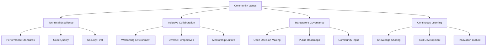

## 2. Community Structure and Governance

### 2.1 Governance Model

#### 2.1.1 Community Roles and Responsibilities
```bash
Community Hierarchy:
├── Core Maintainers (5-7 people)
│   ├── Final decision authority on technical direction
│   ├── Release management and security oversight
│   ├── Community standards and code of conduct enforcement
│   └── Strategic partnership and ecosystem development
├── Module Maintainers (15-20 people)  
│   ├── Domain expertise in specific components
│   ├── Code review and merge authority for modules
│   ├── Technical mentorship for contributors
│   └── Feature planning and architecture decisions
├── Active Contributors (50+ people)
│   ├── Regular code contributions and bug fixes
│   ├── Documentation and testing improvements
│   ├── Community support and issue triage
│   └── Feature development and enhancement
└── Community Members (Unlimited)
    ├── Bug reports and feature requests
    ├── Documentation feedback and improvements
    ├── Community discussions and knowledge sharing
    └── Testing and validation on different platforms
```

#### 2.1.2 Decision-Making Process
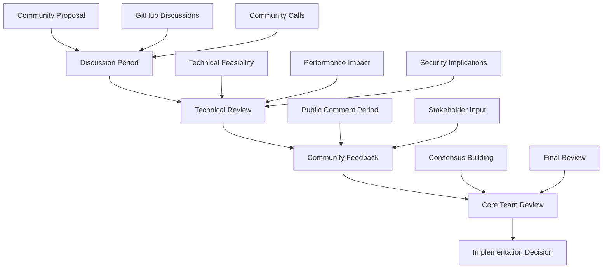

### 2.2 Community Communication Channels

#### 2.2.1 Primary Communication Platforms
```bash
Communication Strategy:
├── GitHub (Primary development hub)
│   ├── Issues and feature requests
│   ├── Pull request discussions
│   ├── Project planning and milestones
│   └── Release notes and announcements
├── Discord Server (Real-time community interaction)
│   ├── #general - Community announcements and news
│   ├── #development - Technical discussions
│   ├── #help - Community support and Q&A
│   ├── #performance - Optimization discussions
│   ├── #security - Security-related topics
│   └── #random - Off-topic community building
├── Monthly Community Calls (Video conferences)
│   ├── Project updates and roadmap discussions
│   ├── Technical deep dives and presentations
│   ├── Community Q&A sessions
│   └── Guest speakers and ecosystem updates
└── Documentation Hub (Knowledge base)
    ├── Getting started guides
    ├── Architecture documentation
    ├── API references
    └── Best practices and tutorials
```

## 3. Contributor Onboarding and Development

### 3.1 New Contributor Journey

#### 3.1.1 Onboarding Process Design
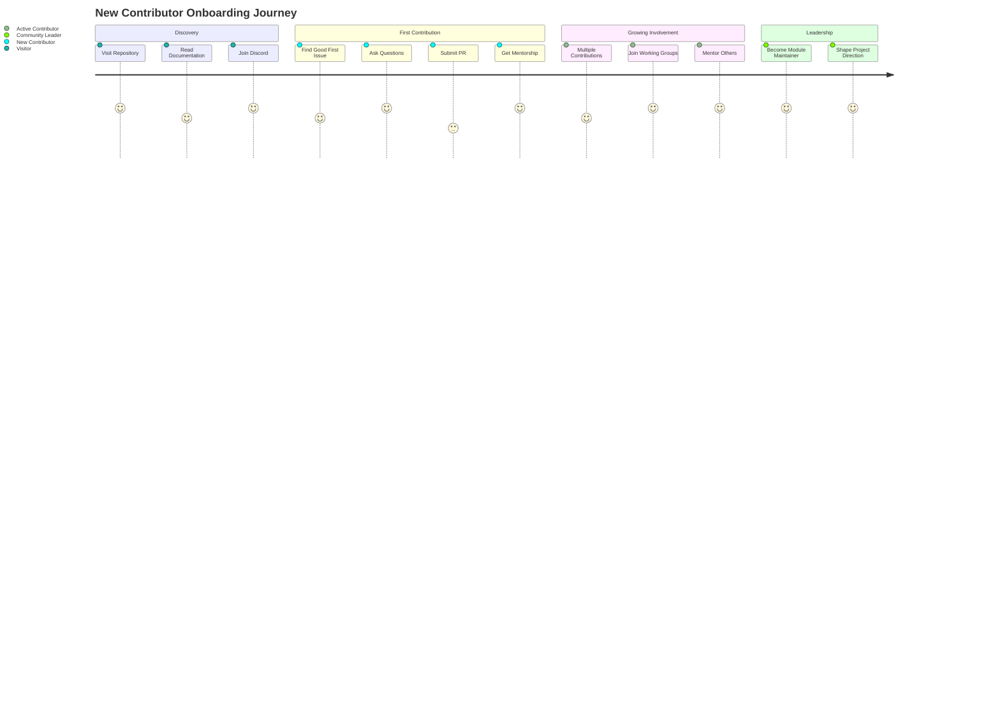

#### 3.1.2 Onboarding Documentation Structure
```bash
Onboarding Documentation:
├── 📖 Getting Started Guide
│   ├── Prerequisites and system requirements
│   ├── Development environment setup
│   ├── Building and testing instructions
│   └── First contribution walkthrough
├── 🎯 Good First Issues
│   ├── Documentation improvements
│   ├── Test coverage enhancements
│   ├── Small bug fixes and optimizations
│   └── Developer tooling improvements
├── 🏗️ Architecture Deep Dive
│   ├── Tile-based design principles
│   ├── Performance optimization techniques
│   ├── Security considerations
│   └── Networking and consensus components
└── 🤝 Community Guidelines
    ├── Code of conduct
    ├── Contribution guidelines
    ├── Code review expectations
    └── Communication best practices
```

### 3.2 Mentorship and Support Programs

#### 3.2.1 Structured Mentorship Program
```bash
Mentorship Framework:
├── New Contributor Mentorship (1-3 months)
│   ├── 1:1 mentor assignment for first-time contributors
│   ├── Weekly check-ins and guidance sessions
│   ├── Code review mentorship and feedback
│   └── Career development discussions
├── Domain Expert Mentorship (3-6 months)
│   ├── Specialized guidance in performance optimization
│   ├── Security best practices training
│   ├── Architecture design mentorship
│   └── Technical leadership development
├── Community Leadership Development (6+ months)
│   ├── Project management and coordination skills
│   ├── Community building and engagement
│   ├── Technical decision-making processes
│   └── Open source governance and sustainability
└── Cross-Mentorship Opportunities
    ├── Peer learning groups and study sessions
    ├── Code pairing and collaborative development
    ├── Knowledge sharing presentations
    └── Community event organization
```

### 3.3 Recognition and Rewards System

#### 3.3.1 Contributor Recognition Framework
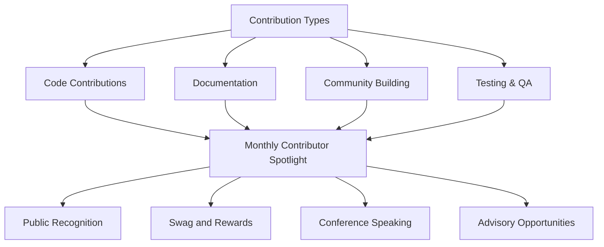

## 4. Documentation and Knowledge Sharing

### 4.1 Comprehensive Documentation Strategy

#### 4.1.1 Documentation Architecture
```bash
Documentation Ecosystem:
├── 📚 User Documentation
│   ├── Installation and configuration guides
│   ├── Validator setup and operation
│   ├── Performance tuning and optimization
│   └── Troubleshooting and FAQ
├── 🔧 Developer Documentation
│   ├── API references and examples
│   ├── Architecture guides and design patterns
│   ├── Contributing guidelines and workflows
│   └── Testing and debugging resources
├── 🏛️ Governance Documentation
│   ├── Project roadmap and milestones
│   ├── Decision-making processes
│   ├── Community guidelines and policies
│   └── Security and vulnerability reporting
└── 📊 Educational Content
    ├── Blockchain consensus mechanisms
    ├── High-performance systems design
    ├── Solana ecosystem integration
    └── Industry best practices and trends
```

#### 4.1.2 Documentation Quality Standards
```markdown
## Documentation Review Checklist

### Content Quality
- [ ] Technically accurate and up-to-date
- [ ] Clear and concise language
- [ ] Appropriate for target audience
- [ ] Includes practical examples

### Structure and Navigation
- [ ] Logical organization and flow
- [ ] Consistent formatting and style
- [ ] Effective use of headings and sections
- [ ] Cross-references and internal links

### Accessibility and Inclusivity
- [ ] Plain language principles
- [ ] Inclusive and welcoming tone
- [ ] Multiple learning styles supported
- [ ] Accessibility guidelines followed

### Maintenance and Updates
- [ ] Version control and change tracking
- [ ] Regular review and update schedule
- [ ] Community feedback integration
- [ ] Automated accuracy validation
```

### 4.2 Knowledge Sharing Initiatives

#### 4.2.1 Community Learning Programs
```bash
Learning and Development:
├── Technical Webinar Series (Monthly)
│   ├── Deep dives into Firedancer components
│   ├── Performance optimization techniques
│   ├── Security best practices
│   └── Industry trend discussions
├── Workshop and Tutorial Program (Quarterly)
│   ├── Hands-on development workshops
│   ├── Validator setup and operation training
│   ├── Contribution workflow tutorials
│   └── Open source best practices
├── Community Conference and Events
│   ├── Annual Firedancer Developer Conference
│   ├── Blockchain and validator meetups
│   ├── University outreach and education
│   └── Industry conference presentations
└── Digital Learning Resources
    ├── Video tutorial library
    ├── Interactive coding exercises
    ├── Case study documentation
    └── Best practices knowledge base
```

## 5. Ecosystem Integration and Partnerships

### 5.1 Stakeholder Engagement Strategy

#### 5.1.1 Key Stakeholder Groups
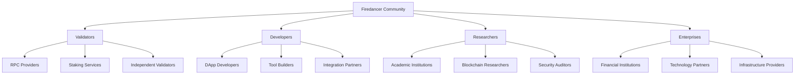

#### 5.1.2 Partnership Development Framework
```bash
Partnership Strategy:
├── Technical Partnerships
│   ├── Integration with major RPC providers
│   ├── Collaboration with monitoring services
│   ├── Hardware vendor optimizations
│   └── Cloud infrastructure partnerships
├── Educational Partnerships
│   ├── University blockchain programs
│   ├── Developer bootcamp collaborations
│   ├── Online learning platform integration
│   └── Certification program development
├── Research Partnerships
│   ├── Academic research collaborations
│   ├── Industry working group participation
│   ├── Standards development contributions
│   └── Open source security initiatives
└── Community Partnerships
    ├── Other validator client collaborations
    ├── Blockchain ecosystem partnerships
    ├── Developer community cross-pollination
    └── Industry conference and event partnerships
```

### 5.2 Developer Ecosystem Growth

#### 5.2.1 Developer Tools and Resources
```bash
Developer Ecosystem:
├── 🛠️ Development Tools
│   ├── Firedancer SDK and libraries
│   ├── Testing and debugging utilities
│   ├── Performance profiling tools
│   └── Integration testing frameworks
├── 📖 Learning Resources
│   ├── Comprehensive API documentation
│   ├── Code examples and templates
│   ├── Video tutorials and walkthroughs
│   └── Interactive development environments
├── 🤝 Community Support
│   ├── Developer forums and Q&A
│   ├── Office hours and support sessions
│   ├── Hackathons and coding competitions
│   └── Mentorship and guidance programs
└── 🎯 Integration Support
    ├── Migration guides from other clients
    ├── Performance optimization consulting
    ├── Security audit and review services
    └── Production deployment assistance
```

## 6. Community Events and Engagement

### 6.1 Event Strategy and Calendar

#### 6.1.1 Annual Event Calendar
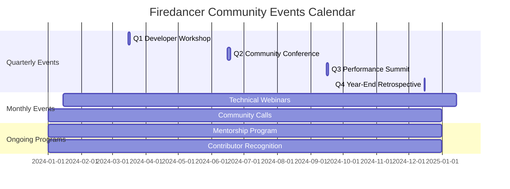

#### 6.1.2 Event Planning and Execution
```bash
Event Management Framework:
├── Planning and Preparation (6-8 weeks before)
│   ├── Venue selection and logistics coordination
│   ├── Speaker recruitment and content planning
│   ├── Registration and marketing campaigns
│   └── Sponsor and partner engagement
├── Event Execution (During event)
│   ├── Technical setup and live streaming
│   ├── Community engagement and networking
│   ├── Content recording and documentation
│   └── Real-time feedback collection
├── Follow-up and Analysis (2-4 weeks after)
│   ├── Content publication and sharing
│   ├── Community feedback analysis
│   ├── Relationship building and follow-up
│   └── Lessons learned and improvement planning
└── Continuous Improvement
    ├── Event format experimentation
    ├── Community preference tracking
    ├── ROI and impact measurement
    └── Best practices documentation
```

### 6.2 Content Creation and Distribution

#### 6.2.1 Content Strategy Framework
```bash
Content Marketing Strategy:
├── Technical Content (40%)
│   ├── Architecture deep dives and technical blogs
│   ├── Performance analysis and optimization guides
│   ├── Security best practices and case studies
│   └── Code tutorials and implementation guides
├── Community Content (30%)
│   ├── Contributor spotlights and interviews
│   ├── Community project showcases
│   ├── Event recaps and highlights
│   └── Behind-the-scenes development stories
├── Educational Content (20%)
│   ├── Blockchain fundamentals and concepts
│   ├── Validator economics and operations
│   ├── Industry trends and analysis
│   └── Comparison studies and benchmarks
└── Promotional Content (10%)
    ├── Project milestones and achievements
    ├── Partnership announcements
    ├── Event invitations and updates
    └── Community growth and statistics
```

## 7. Community Health and Sustainability

### 7.1 Community Health Metrics

#### 7.1.1 Key Performance Indicators
```bash
Community Health Dashboard:
├── Growth Metrics
│   ├── New contributors per month (target: 10+)
│   ├── Active contributors per month (target: 50+)
│   ├── Community member growth rate (target: 20% monthly)
│   └── Geographic diversity index (target: 30+ countries)
├── Engagement Metrics
│   ├── GitHub activity (issues, PRs, discussions)
│   ├── Discord participation and retention
│   ├── Documentation usage and feedback
│   └── Event attendance and satisfaction
├── Quality Metrics
│   ├── Code review participation rates
│   ├── Documentation accuracy and completeness
│   ├── Community sentiment analysis
│   └── Contributor satisfaction surveys
└── Impact Metrics
    ├── Project contributions quality
    ├── Knowledge sharing effectiveness
    ├── Community-driven innovations
    └── Ecosystem adoption and integration
```

### 7.2 Diversity, Equity, and Inclusion (DEI)

#### 7.2.1 DEI Strategy and Implementation
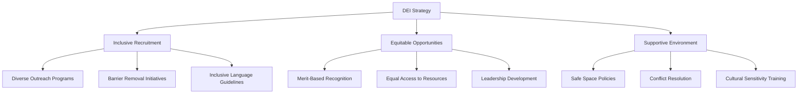

#### 7.2.2 Specific DEI Initiatives
```bash
Diversity and Inclusion Programs:
├── Outreach and Recruitment
│   ├── University diversity program partnerships
│   ├── Underrepresented group targeted events
│   ├── Scholarship and mentorship programs
│   └── Multilingual documentation initiatives
├── Inclusive Environment
│   ├── Code of conduct enforcement
│   ├── Bias training for maintainers
│   ├── Inclusive language guidelines
│   └── Cultural competency development
├── Equitable Opportunities
│   ├── Merit-based contributor recognition
│   ├── Equal access to leadership roles
│   ├── Fair resource allocation
│   └── Transparent decision-making processes
└── Measurement and Accountability
    ├── Regular diversity metrics tracking
    ├── Community satisfaction surveys
    ├── Exit interview analysis
    └── External diversity audits
```

## 8. Quality Assurance and Community Standards

### 8.1 Code Quality and Review Standards

#### 8.1.1 Community Code Review Process
```bash
Code Review Excellence:
├── Review Assignment (Automated)
│   ├── Domain expertise matching
│   ├── Workload balancing
│   ├── Cultural diversity considerations
│   └── Mentorship opportunity identification
├── Review Quality Standards
│   ├── Technical accuracy verification
│   ├── Performance impact assessment
│   ├── Security vulnerability scanning
│   └── Documentation requirement compliance
├── Review Timeline Expectations
│   ├── Initial response: 24 hours
│   ├── Detailed review: 48 hours
│   ├── Follow-up iterations: 24 hours
│   └── Final approval: 72 hours maximum
└── Review Feedback Quality
    ├── Constructive and educational
    ├── Specific and actionable
    ├── Encouraging and supportive
    └── Aligned with community values
```

### 8.2 Community Moderation and Conflict Resolution

#### 8.2.1 Community Guidelines Enforcement
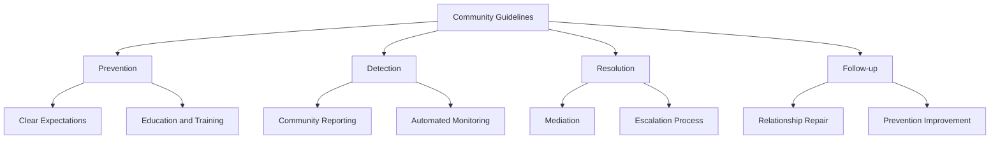

## 9. Community Growth and Outreach

### 9.1 Strategic Outreach Programs

#### 9.1.1 Targeted Outreach Strategy
```bash
Outreach Programs:
├── Academic Outreach
│   ├── University guest lectures and workshops
│   ├── Student project sponsorship
│   ├── Research collaboration opportunities
│   └── Internship and job placement programs
├── Industry Outreach
│   ├── Conference speaking and sponsorship
│   ├── Industry working group participation
│   ├── Professional development partnerships
│   └── Enterprise adoption support
├── Developer Community Outreach
│   ├── Cross-community collaboration events
│   ├── Open source project partnerships
│   ├── Developer tool integration
│   └── Technology stack evangelism
└── Geographic Outreach
    ├── Regional meetup support
    ├── Local language documentation
    ├── Cultural adaptation initiatives
    └── Global community building
```

### 9.2 Marketing and Brand Building

#### 9.2.1 Community Brand Strategy
```bash
Brand and Marketing Strategy:
├── Technical Thought Leadership
│   ├── Performance benchmark publications
│   ├── Security best practices evangelism
│   ├── Architecture innovation showcases
│   └── Industry standard contributions
├── Community Success Stories
│   ├── Contributor journey narratives
│   ├── Project impact case studies
│   ├── Innovation and breakthrough highlights
│   └── Community achievement celebrations
├── Educational Content Marketing
│   ├── Technical blog series and tutorials
│   ├── Video content and webinar series
│   ├── Podcast appearances and hosting
│   └── Social media engagement strategy
└── Partnership and Ecosystem Marketing
    ├── Integration success stories
    ├── Partnership announcement strategies
    ├── Ecosystem contribution highlights
    └── Industry recognition and awards
```

## 10. Technology and Infrastructure

### 10.1 Community Platform Infrastructure

#### 10.1.1 Technical Platform Architecture
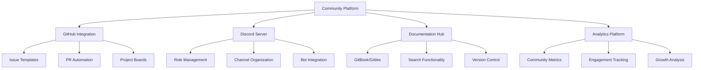

#### 10.1.2 Community Tools and Automation
```bash
Community Infrastructure:
├── GitHub Organization Management
│   ├── Automated issue triage and labeling
│   ├── Pull request review assignment
│   ├── Release automation and notifications
│   └── Security scanning and compliance
├── Discord Server Administration
│   ├── Role-based access control
│   ├── Automated moderation and spam protection
│   ├── Integration with GitHub notifications
│   └── Event scheduling and reminder systems
├── Documentation Platform
│   ├── Automated documentation generation
│   ├── Version synchronization with code
│   ├── Search and navigation optimization
│   └── Multilingual support and translation
└── Analytics and Monitoring
    ├── Community health dashboards
    ├── Engagement metrics tracking
    ├── Growth trend analysis
    └── Automated reporting and alerts
```

## 11. Measurement and Continuous Improvement

### 11.1 Success Metrics and KPIs

#### 11.1.1 Community Impact Measurement
```bash
Community Success Metrics:
├── Contributor Growth and Retention
│   ├── Monthly active contributors (target: 50+)
│   ├── New contributor onboarding success (target: 80%)
│   ├── Contributor retention rate (target: 70% annual)
│   └── Geographic diversity index (target: 25+ countries)
├── Community Engagement Quality
│   ├── Average response time to questions (target: 4 hours)
│   ├── Community satisfaction score (target: 4.5/5)
│   ├── Event attendance rates (target: 80% capacity)
│   └── Documentation usage and feedback (target: 90% helpful)
├── Technical Contribution Impact
│   ├── Community-contributed features (target: 30% of releases)
│   ├── Bug reports and fixes from community (target: 50+/month)
│   ├── Performance improvements contributed (target: 5% gains)
│   └── Security vulnerabilities reported (target: responsible disclosure)
└── Ecosystem Growth and Adoption
    ├── Integration partnerships (target: 10+ per quarter)
    ├── Community-driven tools and utilities (target: 20+ projects)
    ├── Educational content creation (target: 50+ resources)
    └── Industry recognition and awards (target: 3+ annually)
```

### 11.2 Feedback Collection and Implementation

#### 11.2.1 Community Feedback Framework
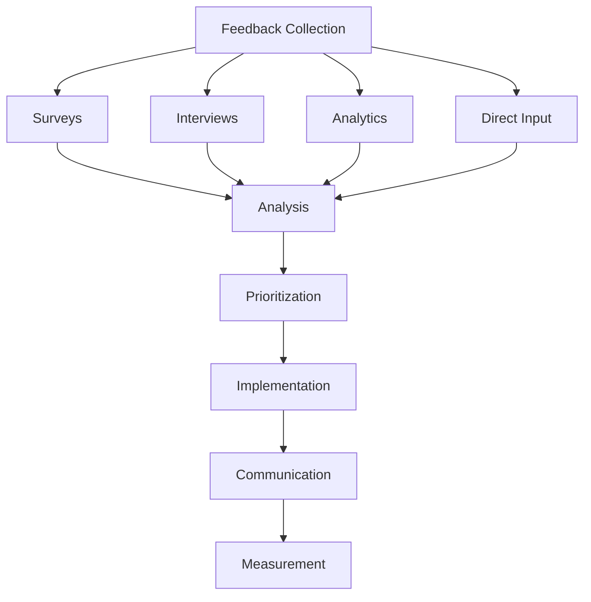

## 12. Implementation Timeline and Milestones

### 12.1 Community Engagement Roadmap

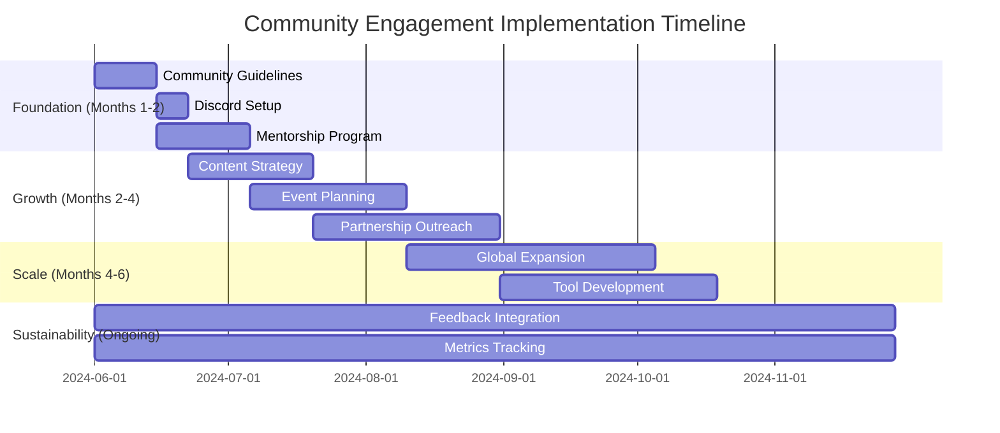

This comprehensive community engagement plan provides the framework for building a thriving, inclusive, and technically excellent open-source community around Firedancer, ensuring sustainable growth and meaningful contributor engagement while maintaining the project's exceptional standards.