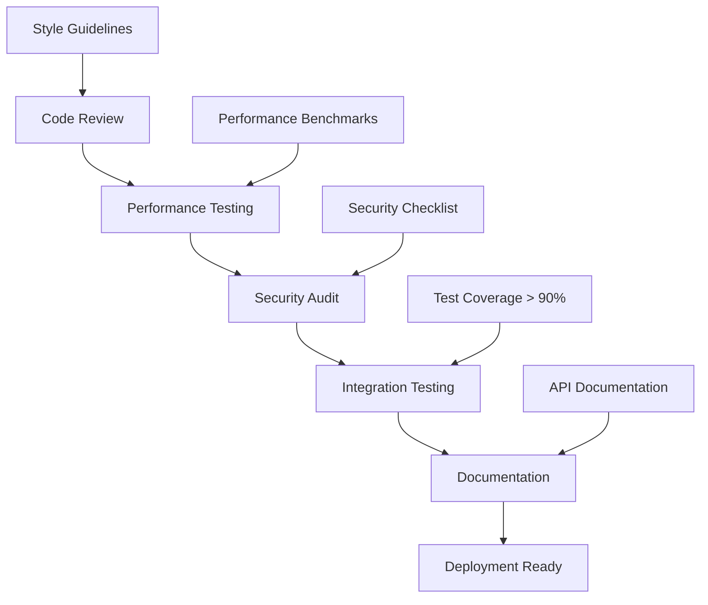
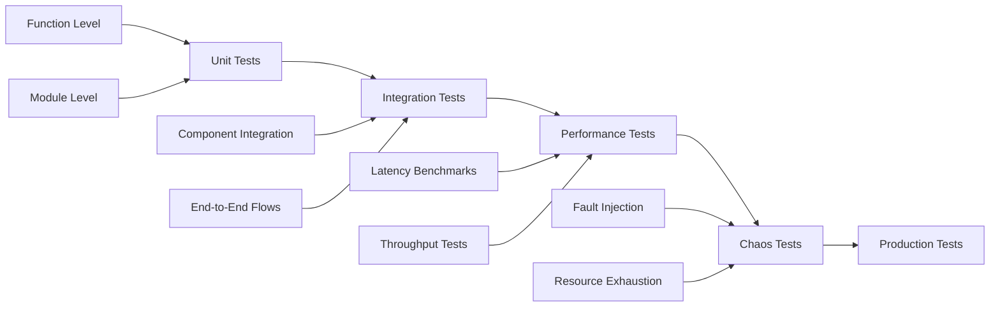
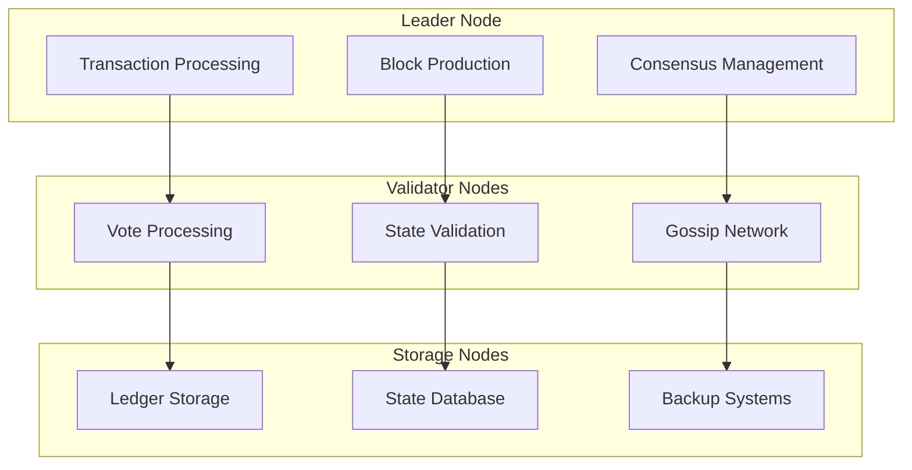
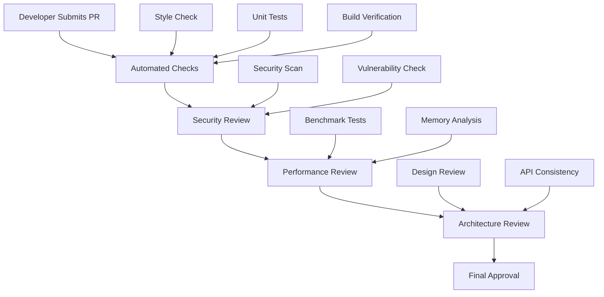
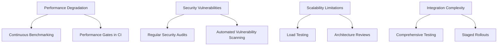
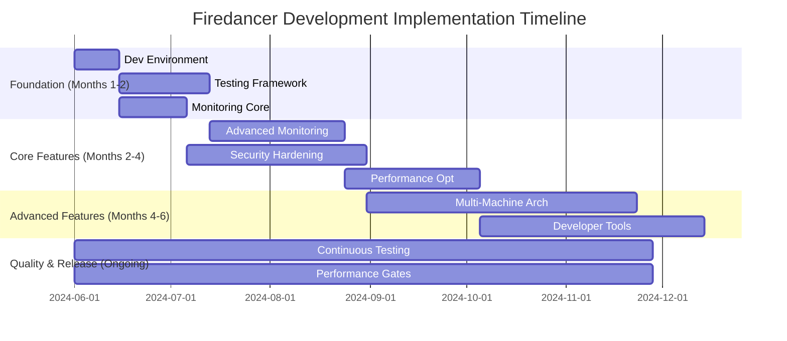

# Firedancer Development Plan

## Executive Summary

This development plan provides a comprehensive technical roadmap for implementing the strategic objectives identified in the Firedancer codebase review. It details specific coding tasks, technical implementation strategies, architecture decisions, and development workflows to transform Firedancer from a strong technical foundation into a world-class validator platform.

## 1. Development Philosophy and Principles

### 1.1 Core Development Principles

- **Performance First**: Every feature must meet strict performance requirements (sub-millisecond latency)
- **Security by Design**: Security considerations integrated from the first line of code
- **Zero-Copy Architecture**: Minimize memory allocations and data copying
- **Lock-Free Programming**: Eliminate synchronization bottlenecks
- **Modular Design**: Maintain tile-based architecture for scalability
- **Comprehensive Testing**: Unit, integration, and performance testing for all components

### 1.2 Technical Standards



## 2. Phase 1: Foundation and Infrastructure (Months 1-2)

### 2.1 Development Environment Enhancement

#### 2.1.1 IDE Integration and Tooling
```bash
# Priority 1: Enhanced Development Setup
Priority: High
Timeline: 2 weeks
Team: Developer Experience

Tasks:
├── Enhanced VS Code configuration
│   ├── IntelliSense for Firedancer APIs
│   ├── Custom debugging configurations
│   ├── Performance profiling integration
│   └── Code formatting automation
├── Comprehensive Makefile improvements
│   ├── Parallel build optimization
│   ├── Incremental build support
│   ├── Cross-compilation targets
│   └── Performance build variants
└── Development container setup
    ├── Dockerfile for consistent environments
    ├── Dev container configuration
    ├── Pre-installed dependencies
    └── Performance analysis tools
```

#### 2.1.2 Build System Optimization
```c
/* Build system improvements */
// File: GNUmakefile.enhanced

# Add performance-optimized build targets
performance: CFLAGS += -O3 -march=native -DNDEBUG
performance: all

# Add debug build with comprehensive instrumentation
debug: CFLAGS += -g3 -O0 -fsanitize=address -fsanitize=undefined
debug: all

# Add benchmark build for performance testing
benchmark: CFLAGS += -O3 -DBENCHMARK_MODE -pg
benchmark: all
```

### 2.2 Comprehensive Testing Framework

#### 2.2.1 Testing Infrastructure Design


#### 2.2.2 Testing Implementation Strategy
```bash
# Priority 2: Testing Framework Implementation
Priority: High
Timeline: 4 weeks
Team: Quality Assurance + Core Development

Phase 1 (Week 1-2): Unit Testing Enhancement
├── Expand existing unit test coverage to 95%
├── Add property-based testing for cryptographic functions
├── Implement mock frameworks for external dependencies
└── Create automated test report generation

Phase 2 (Week 3-4): Integration Testing
├── Full validator integration tests
├── Multi-node consensus testing
├── Network partition simulation
└── State synchronization testing
```

### 2.3 Performance Monitoring and Profiling

#### 2.3.1 Performance Monitoring Architecture
```c
/* Performance monitoring implementation */
// File: src/util/fd_metrics.h

#define FD_METRICS_ENABLED 1

typedef struct fd_metrics {
  ulong latency_ns;           /* Operation latency in nanoseconds */
  ulong throughput_tps;       /* Transactions per second */
  ulong memory_usage_bytes;   /* Current memory usage */
  ulong cpu_utilization_pct;  /* CPU utilization percentage */
  ulong network_bytes_sec;    /* Network throughput */
} fd_metrics_t;

/* Real-time metrics collection */
void fd_metrics_record_latency( fd_metrics_t * metrics, ulong start_ns );
void fd_metrics_record_throughput( fd_metrics_t * metrics, ulong tx_count );
void fd_metrics_export_prometheus( fd_metrics_t * metrics );
```

## 3. Phase 2: Core Feature Development (Months 2-4)

### 3.1 Enhanced Monitoring and Observability

#### 3.1.1 Comprehensive Metrics System
```bash
# Priority 3: Monitoring System Implementation
Priority: High
Timeline: 6 weeks
Team: Platform Engineering

Sprint 1 (Weeks 1-2): Core Metrics
├── Transaction processing metrics
├── Consensus state monitoring
├── Network health indicators
└── Resource utilization tracking

Sprint 2 (Weeks 3-4): Advanced Analytics
├── Performance trend analysis
├── Anomaly detection systems
├── Predictive scaling indicators
└── Security event correlation

Sprint 3 (Weeks 5-6): Visualization and Alerting
├── Grafana dashboard development
├── Alert manager configuration
├── Custom visualization components
└── Mobile monitoring app
```

#### 3.1.2 Observability Implementation
```c
/* Distributed tracing implementation */
// File: src/disco/fd_tracing.h

typedef struct fd_trace_span {
  char const * operation_name;
  ulong        start_time_ns;
  ulong        duration_ns;
  char const * trace_id;
  char const * span_id;
  char const * parent_span_id;
} fd_trace_span_t;

/* Tracing macros for zero-overhead instrumentation */
#define FD_TRACE_BEGIN( op_name ) \
  fd_trace_span_t _span = fd_trace_span_begin( op_name )

#define FD_TRACE_END() \
  fd_trace_span_end( &_span )
```

### 3.2 Security Hardening Implementation

#### 3.2.1 Runtime Security Monitoring
```bash
# Priority 4: Security Enhancement
Priority: High
Timeline: 8 weeks
Team: Security Engineering

Phase 1 (Weeks 1-3): Detection Systems
├── Anomaly detection for consensus behavior
├── Network intrusion detection integration
├── Memory corruption detection enhancement
└── Cryptographic operation monitoring

Phase 2 (Weeks 4-6): Response Systems
├── Automated incident response
├── Security event correlation
├── Threat intelligence integration
└── Forensic data collection

Phase 3 (Weeks 7-8): Hardening
├── Additional sandboxing layers
├── Privilege separation enhancements
├── Supply chain security measures
└── Penetration testing automation
```

### 3.3 Performance Optimization Framework

#### 3.3.1 Advanced Performance Features
```c
/* Auto-tuning performance optimization */
// File: src/ballet/fd_auto_tune.h

typedef struct fd_auto_tuner {
  ulong target_latency_ns;
  ulong current_latency_ns;
  ulong adjustment_factor;
  ulong optimization_strategy;
} fd_auto_tuner_t;

/* Dynamic performance optimization */
void fd_auto_tune_tx_processing( fd_auto_tuner_t * tuner );
void fd_auto_tune_network_params( fd_auto_tuner_t * tuner );
void fd_auto_tune_memory_layout( fd_auto_tuner_t * tuner );
```

## 4. Phase 3: Advanced Features (Months 4-6)

### 4.1 Multi-Machine Validator Architecture

#### 4.1.1 Distributed Architecture Design


#### 4.1.2 Implementation Roadmap
```bash
# Priority 5: Multi-Machine Architecture
Priority: Medium
Timeline: 12 weeks
Team: Core Architecture + Distributed Systems

Phase 1 (Weeks 1-4): Foundation
├── Distributed consensus protocol enhancement
├── Inter-node communication optimization
├── Fault tolerance mechanisms
└── Network partition handling

Phase 2 (Weeks 5-8): Implementation
├── Load balancing across validator nodes
├── Dynamic node discovery and management
├── State synchronization protocols
└── Conflict resolution mechanisms

Phase 3 (Weeks 9-12): Optimization
├── Performance tuning for distributed operations
├── Network latency optimization
├── Bandwidth usage optimization
└── Cost-effectiveness analysis
```

### 4.2 Developer Experience Enhancement

#### 4.2.1 Advanced Development Tools
```bash
# Priority 6: Developer Tooling
Priority: Medium
Timeline: 10 weeks
Team: Developer Experience

Sprint 1 (Weeks 1-3): Core Tools
├── Enhanced debugging tools with performance profiling
├── Interactive development environment
├── Code generation tools for boilerplate
└── API documentation automation

Sprint 2 (Weeks 4-6): Testing Tools
├── Property-based testing framework
├── Chaos engineering tools
├── Performance regression detection
└── Automated vulnerability scanning

Sprint 3 (Weeks 7-10): Integration Tools
├── CI/CD pipeline enhancements
├── Deployment automation
├── Configuration management
└── Rollback and recovery tools
```

## 5. Development Workflows and Best Practices

### 5.1 Code Review Process

#### 5.1.1 Multi-Stage Review Process


#### 5.1.2 Review Checklist Template
```markdown
## Code Review Checklist

### Performance Requirements
- [ ] Latency impact measured and acceptable
- [ ] Memory allocation patterns verified
- [ ] CPU utilization impact assessed
- [ ] Network overhead minimized

### Security Requirements
- [ ] Input validation implemented
- [ ] Memory safety verified
- [ ] Privilege escalation prevented
- [ ] Cryptographic operations audited

### Architecture Requirements
- [ ] Design patterns followed
- [ ] Module boundaries respected
- [ ] API consistency maintained
- [ ] Documentation updated
```

### 5.2 Continuous Integration Enhancement

#### 5.2.1 Enhanced CI Pipeline
```yaml
# File: .github/workflows/enhanced_ci.yml
name: Enhanced Firedancer CI

on: [push, pull_request]

jobs:
  performance_gate:
    runs-on: ubuntu-latest
    steps:
      - name: Performance Regression Check
        run: |
          make benchmark
          ./scripts/performance_comparison.sh

  security_scan:
    runs-on: ubuntu-latest
    steps:
      - name: Static Security Analysis
        run: |
          codeql analyze
          ./scripts/security_audit.sh

  integration_tests:
    runs-on: ubuntu-latest
    strategy:
      matrix:
        test_suite: [consensus, networking, storage]
    steps:
      - name: Run Integration Tests
        run: make test-integration-${{ matrix.test_suite }}
```

## 6. Technology Stack and Dependencies

### 6.1 Core Technology Decisions

#### 6.1.1 Programming Languages and Tools
```bash
Primary Languages:
├── C (99% of codebase) - Systems programming, performance critical
├── Assembly (1% of codebase) - Hardware-specific optimizations
├── Shell Scripts - Build and deployment automation
└── Python - Testing and automation scripts

Development Tools:
├── GCC/Clang - Primary compilers with optimization flags
├── Valgrind - Memory debugging and profiling
├── Perf - Performance analysis and profiling
├── GDB - Debugging with custom extensions
├── AddressSanitizer - Memory safety validation
└── Static Analysis - Comprehensive code analysis

Monitoring and Observability:
├── Prometheus - Metrics collection and storage
├── Grafana - Visualization and dashboards
├── OpenTelemetry - Distributed tracing
├── Custom Metrics - Firedancer-specific instrumentation
└── Alert Manager - Intelligent alerting system
```

### 6.2 Performance Optimization Strategy

#### 6.2.1 Optimization Priorities
```c
/* Performance optimization framework */
// File: src/util/fd_optimization.h

typedef enum fd_optimization_level {
  FD_OPT_DEVELOPMENT = 0,  /* Debug builds with instrumentation */
  FD_OPT_TESTING     = 1,  /* Optimized builds with verification */
  FD_OPT_PRODUCTION  = 2,  /* Maximum performance optimization */
  FD_OPT_BENCHMARK   = 3   /* Extreme optimization for benchmarking */
} fd_optimization_level_t;

/* Compile-time optimization selection */
#if FD_OPTIMIZATION_LEVEL >= FD_OPT_PRODUCTION
  #define FD_LIKELY(x)   __builtin_expect(!!(x), 1)
  #define FD_UNLIKELY(x) __builtin_expect(!!(x), 0)
  #define FD_FORCE_INLINE __attribute__((always_inline)) inline
#else
  #define FD_LIKELY(x)   (x)
  #define FD_UNLIKELY(x) (x)
  #define FD_FORCE_INLINE inline
#endif
```

## 7. Quality Assurance and Testing Strategy

### 7.1 Comprehensive Testing Framework

#### 7.1.1 Testing Pyramid Implementation
```bash
Testing Strategy:
├── Unit Tests (70% of test effort)
│   ├── Function-level testing with 100% branch coverage
│   ├── Property-based testing for cryptographic functions
│   ├── Mock-based testing for external dependencies
│   └── Performance regression testing
├── Integration Tests (20% of test effort)
│   ├── Component interaction testing
│   ├── End-to-end validator scenarios
│   ├── Network partition and recovery testing
│   └── Multi-node consensus validation
└── System Tests (10% of test effort)
    ├── Full production scenario simulation
    ├── Chaos engineering and fault injection
    ├── Performance benchmark validation
    └── Security penetration testing
```

### 7.2 Performance Testing Framework

#### 7.2.1 Benchmark Suite Design
```c
/* Performance benchmark framework */
// File: src/util/fd_benchmark.h

typedef struct fd_benchmark_result {
  char const * test_name;
  ulong        iterations;
  ulong        min_latency_ns;
  ulong        max_latency_ns;
  ulong        avg_latency_ns;
  ulong        p99_latency_ns;
  ulong        throughput_ops_sec;
} fd_benchmark_result_t;

/* Benchmark execution framework */
#define FD_BENCHMARK( test_name, iterations, test_code ) \
  fd_benchmark_result_t test_name##_benchmark() { \
    /* Benchmark implementation */ \
  }
```

## 8. Release Management and Deployment

### 8.1 Release Strategy

#### 8.1.1 Release Cadence and Versioning
```bash
Release Strategy:
├── Semantic Versioning (MAJOR.MINOR.PATCH)
├── Monthly minor releases with feature additions
├── Weekly patch releases for critical fixes
├── Quarterly major releases with breaking changes
└── Continuous deployment for internal testing

Release Phases:
├── Alpha (Internal testing, 2 weeks)
├── Beta (Community testing, 2 weeks)
├── Release Candidate (Production validation, 1 week)
└── Stable Release (Production deployment)
```

### 8.2 Deployment Automation

#### 8.2.1 Infrastructure as Code
```yaml
# File: infrastructure/deployment.yml
apiVersion: v1
kind: ConfigMap
metadata:
  name: firedancer-config
data:
  performance.conf: |
    # Performance-optimized configuration
    cpu_affinity_mask=0xFF
    numa_policy=local
    huge_pages_enabled=true
    network_buffer_size=16MB

  monitoring.conf: |
    # Comprehensive monitoring configuration
    metrics_export_interval=1s
    distributed_tracing=enabled
    log_level=info
    alert_thresholds=high_performance
```

## 9. Success Metrics and KPIs

### 9.1 Development Performance Metrics

#### 9.1.1 Key Performance Indicators
```bash
Development Velocity:
├── Code commits per week (target: 50+ commits)
├── Feature delivery time (target: 2 weeks per feature)
├── Bug fix time (target: 24 hours for critical, 1 week for normal)
└── Code review time (target: 24 hours)

Code Quality Metrics:
├── Test coverage (target: >95%)
├── Static analysis violations (target: 0 critical)
├── Performance regression incidents (target: 0 per release)
└── Security vulnerabilities (target: 0 high/critical)

Performance Metrics:
├── Transaction processing latency (target: <100μs p99)
├── Consensus finality time (target: <400ms)
├── Network throughput (target: >100k TPS)
└── Memory usage (target: <8GB per validator)
```

## 10. Risk Management and Mitigation

### 10.1 Technical Risk Assessment

#### 10.1.1 Risk Mitigation Strategies


## 11. Implementation Timeline

### 11.1 Detailed Implementation Schedule



This comprehensive development plan provides the technical foundation for implementing the strategic roadmap while maintaining Firedancer's exceptional performance standards and architectural principles.