# Phase 3: Comprehensive Documentation with Visual Diagrams

## Executive Summary

This phase provides comprehensive documentation with visual diagrams to improve understanding and maintainability of the Firedancer codebase. All diagrams are created using Mermaid syntax for easy embedding and version control.

## 1. Architectural Overview

### 1.1 High-Level System Architecture

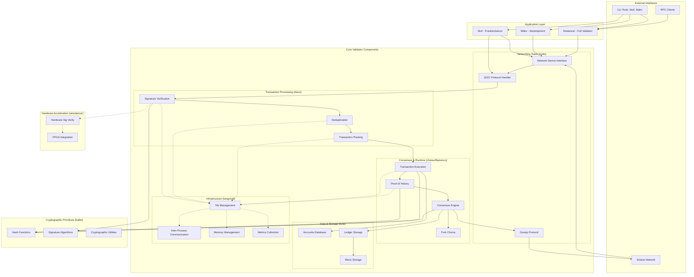

### 1.2 Component Interaction Overview

The Firedancer validator is built around a **tile-based architecture** where each tile represents a specialized thread running on a dedicated CPU core. This design optimizes for:

- **Performance**: Lock-free communication and CPU cache optimization
- **Scalability**: Independent scaling of different validator functions
- **Reliability**: Fault isolation between components
- **Maintainability**: Clear separation of concerns

**Core Design Principles:**
1. **Zero-copy networking** for maximum throughput
2. **Lock-free data structures** for low latency
3. **CPU core isolation** for predictable performance
4. **Custom memory management** for efficiency
5. **Hardware acceleration** where beneficial

### 1.3 Data Flow Architecture

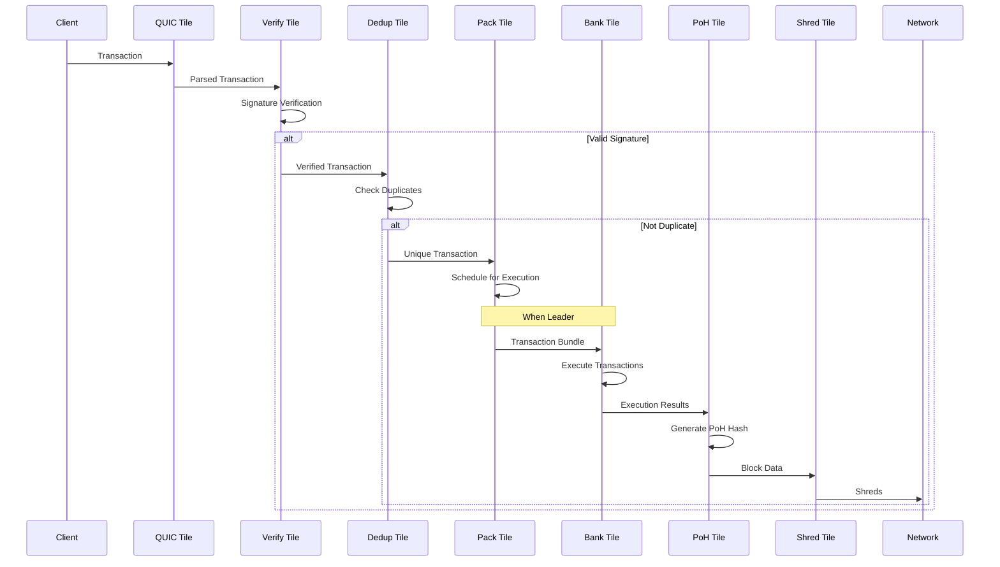

## 2. Key Component Documentation

### 2.1 Networking Layer (waltz)

**Purpose**: High-performance networking stack optimized for Solana's requirements

**Key Components:**
- **Network Device Interface**: Direct hardware interaction for minimal latency
- **QUIC Implementation**: Custom QUIC stack for transaction ingestion
- **Packet Processing**: Zero-copy packet handling

**Configuration:**
```toml
[tiles.net]
  interface = "eth0"
  xdp_mode = "drv"
  xsk_map_cnt = 16
```

### 2.2 Transaction Processing Pipeline (disco)

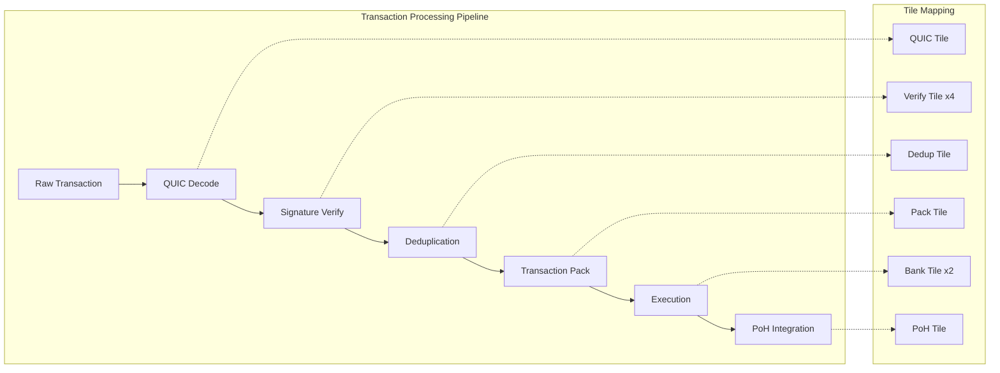

**Performance Characteristics:**
- **QUIC Tiles**: >1M TPS per tile
- **Verify Tiles**: 20-40k TPS per tile (recommend 4+ tiles)
- **Bank Tiles**: 20-40k TPS per tile (recommend 2 tiles)
- **Other Tiles**: Generally 1 tile sufficient for current mainnet

### 2.3 Consensus Engine (choreo)

**Purpose**: Implements Solana's consensus mechanism including fork choice and voting

**Key Components:**
- **Fork Choice**: Tower BFT implementation
- **Voting**: Validator vote generation and processing
- **Leader Schedule**: Block production scheduling

### 2.4 Runtime Environment (flamenco)

**Purpose**: Solana runtime components for transaction execution

**Key Components:**
- **Transaction Execution**: EVM-like execution environment
- **Account Management**: Account state tracking
- **Program Interface**: Smart contract execution

### 2.5 Database Layer (funk)

**Purpose**: High-performance database optimized for Solana's access patterns

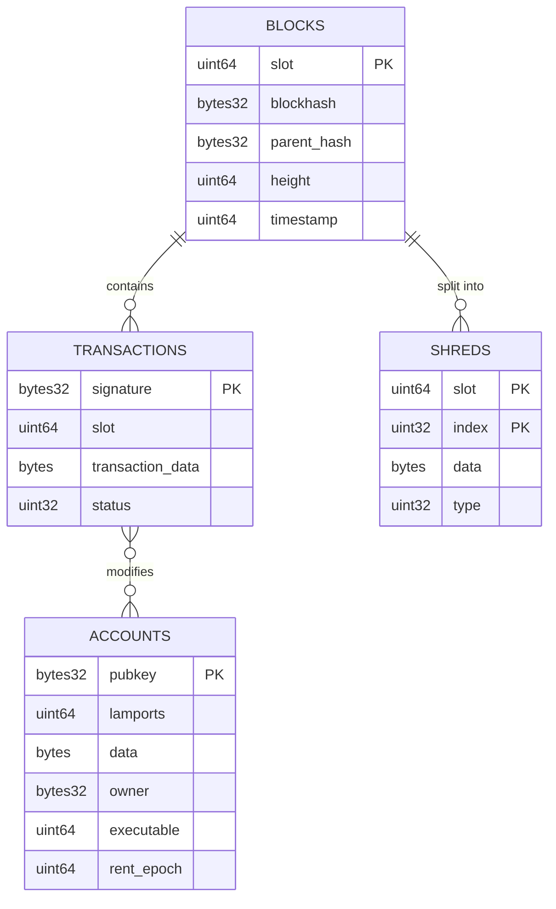

### 2.6 IPC Layer (tango)

**Purpose**: High-performance inter-process communication between tiles

**Key Features:**
- **Lock-free message passing**: Using atomic operations
- **Zero-copy data transfer**: Shared memory regions
- **Flow control**: Credit-based backpressure handling

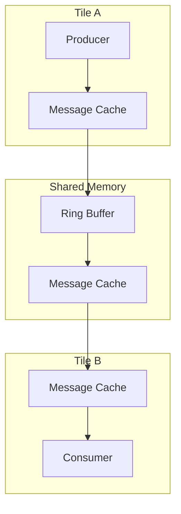

### 2.7 Hardware Acceleration (wiredancer)

**Purpose**: FPGA-based acceleration for computationally intensive operations

**Current Focus**: ED25519 signature verification acceleration

**Performance Improvement:**
- **CPU (Skylake 2.4GHz)**: 30k signatures/second per core (33 cores for 1M/sec)
- **FPGA (AWS-F1)**: 1M signatures/second per card (1 card for 1M/sec)

## 3. Configuration and Deployment

### 3.1 Configuration Structure

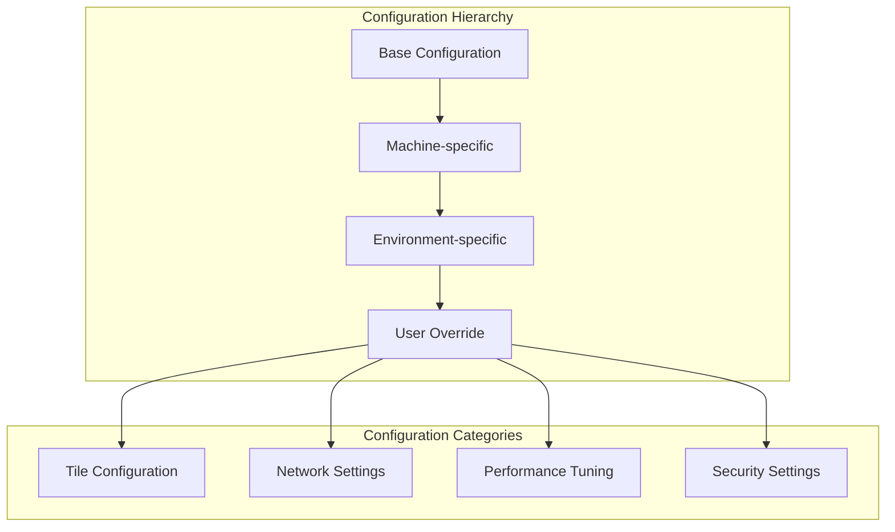

### 3.2 Deployment Patterns

#### 3.2.1 Development Deployment
```bash
# Setup development environment
git clone --recurse-submodules https://github.com/firedancer-io/firedancer.git
cd firedancer
./deps.sh +dev
make -j run
```

#### 3.2.2 Production Deployment (Frankendancer)
```bash
# Production setup
./deps.sh
make MACHINE=production_target -j
sudo ./fdctl configure init
sudo ./fdctl monitor
```

### 3.3 Monitoring and Metrics

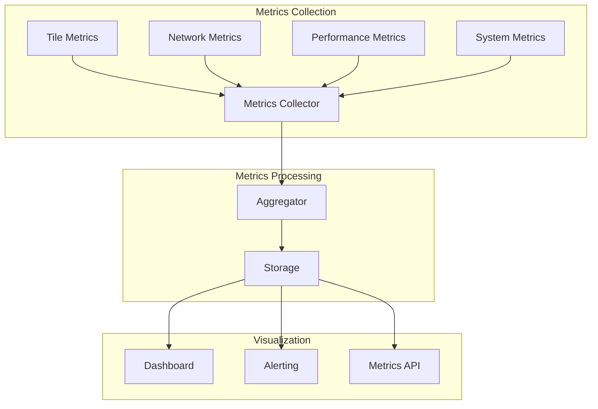

## 4. Security Architecture

### 4.1 Security Layers

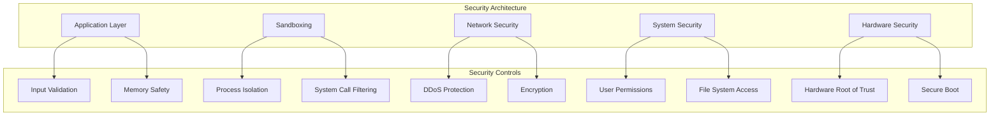

### 4.2 Attack Surface Analysis

**Minimized Attack Surface:**
- **Reduced system calls**: Highly restrictive sandbox
- **Memory safety**: Custom memory management with bounds checking
- **Input validation**: Multiple layers of input sanitization
- **Process isolation**: Each tile runs in isolation
- **Minimal dependencies**: Reduced external library dependencies

## 5. Performance Architecture

### 5.1 Performance Optimization Strategies

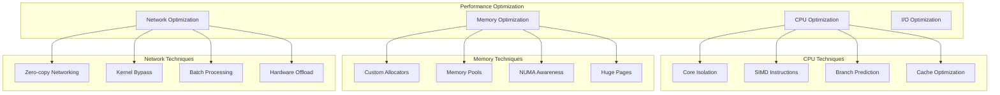

### 5.2 Scalability Model

The tile-based architecture enables horizontal scaling:

1. **Scale verification**: Add more verify tiles for higher TPS
2. **Scale execution**: Add more bank tiles for complex transactions
3. **Scale networking**: Add more QUIC tiles for more clients
4. **Scale storage**: Distribute database across multiple instances

## 6. Development Workflow

### 6.1 Build System Architecture

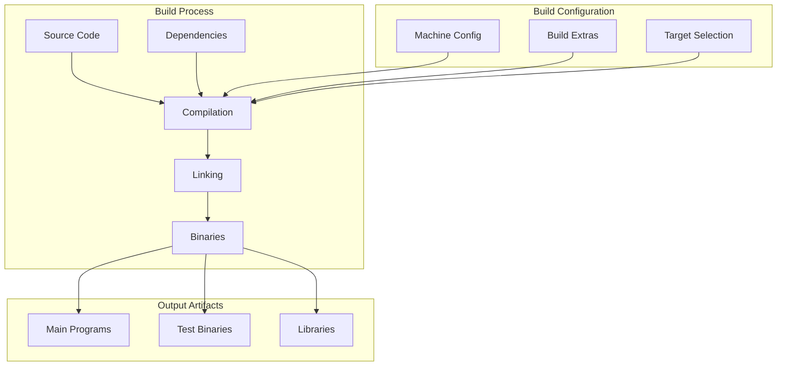

### 6.2 Testing Strategy

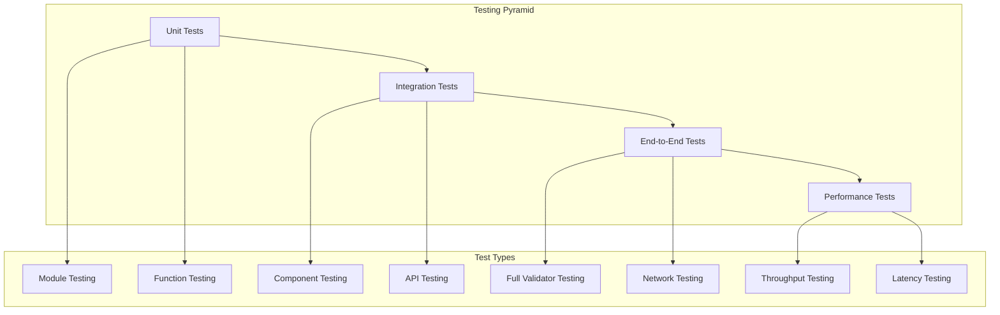

## Conclusion

This documentation provides a comprehensive view of the Firedancer architecture with visual diagrams to aid understanding. The modular, tile-based design enables high performance while maintaining clear separation of concerns. The architecture is well-suited for the demands of high-frequency blockchain validation while providing the flexibility to scale and adapt to future requirements.