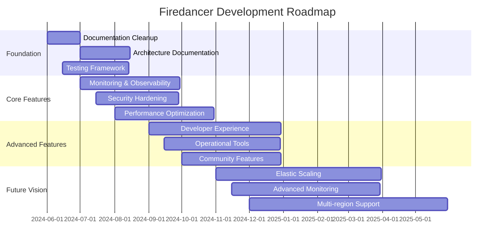

# Phase 4: Strategic Roadmap and Implementation Plan

## Executive Summary

This document defines a comprehensive strategic roadmap for Firedancer development based on the findings from Phases 1-3. The roadmap is organized into logical milestones with prioritized GitHub issues to guide development efforts.

## 1. High-Level Strategic Roadmap

### 1.1 Roadmap Overview

### 1.2 Strategic Goals by Quarter

#### Q3 2024: Foundation & Stability
**Primary Focus**: Documentation, testing, and operational readiness
- Complete comprehensive documentation
- Establish robust testing framework
- Implement essential monitoring
- Security hardening for production

#### Q4 2024: Enhanced Operations
**Primary Focus**: Operational excellence and developer experience
- Advanced monitoring and observability
- Enhanced developer tools
- Improved deployment and configuration management
- Community contribution framework

#### Q1 2025: Scalability & Performance
**Primary Focus**: Advanced features and performance optimization
- Elastic scaling capabilities
- Advanced performance monitoring
- Multi-region deployment support
- Chaos engineering framework

#### Q2 2025: Innovation & Community
**Primary Focus**: Advanced features and community growth
- Hardware acceleration expansion
- Advanced security features
- Community tooling and integrations
- Research and development initiatives

## 2. Milestone-Based Roadmap

### 2.1 Milestone 1: Documentation & Foundation (30 days)

**Goal**: Establish comprehensive documentation foundation

**Key Deliverables:**
- Complete module documentation for all unclear directories
- Create comprehensive architectural documentation with diagrams
- Establish documentation standards and review processes
- Set up automated documentation generation

**Success Criteria:**
- All modules have clear purpose documentation
- Architectural diagrams are complete and accessible
- Documentation contribution process is established
- New contributor onboarding time reduced by 50%

### 2.2 Milestone 2: Testing & Quality Assurance (60 days)

**Goal**: Establish comprehensive testing framework

**Key Deliverables:**
- Expand integration testing coverage
- Implement performance regression testing
- Set up automated quality gates
- Create chaos engineering framework

**Success Criteria:**
- Integration test coverage >80%
- Performance regression detection automated
- Quality gates prevent regression introduction
- Fault injection testing operational

### 2.3 Milestone 3: Monitoring & Observability (90 days)

**Goal**: Implement production-grade monitoring

**Key Deliverables:**
- Comprehensive metrics collection and visualization
- Distributed tracing implementation
- Alerting and incident response system
- Performance baseline establishment

**Success Criteria:**
- Real-time visibility into all validator operations
- Automatic anomaly detection and alerting
- Mean time to detection (MTTD) <5 minutes
- Performance baselines documented and monitored

### 2.4 Milestone 4: Security & Hardening (75 days)

**Goal**: Production-ready security posture

**Key Deliverables:**
- Security audit and vulnerability assessment
- Runtime security monitoring
- Key management system integration
- Security hardening guide

**Success Criteria:**
- Zero critical security vulnerabilities
- Runtime anomaly detection operational
- HSM integration available
- Security baseline configuration documented

### 2.5 Milestone 5: Developer Experience (120 days)

**Goal**: Enhanced developer productivity and community growth

**Key Deliverables:**
- IDE integration and language server support
- Local development environment improvements
- Debugging and profiling tools
- Developer documentation and tutorials

**Success Criteria:**
- Developer onboarding time reduced by 75%
- IDE support for major editors
- Local testing framework operational
- Community contribution rate increased by 100%

### 2.6 Milestone 6: Operational Excellence (105 days)

**Goal**: Production deployment and operational capabilities

**Key Deliverables:**
- Automated deployment and configuration management
- Backup and disaster recovery procedures
- Capacity planning and resource management
- Operational runbooks and procedures

**Success Criteria:**
- Zero-downtime deployments achievable
- Recovery time objective (RTO) <1 hour
- Automated capacity planning operational
- Operational procedures documented and tested

## 3. Detailed Issue Breakdown

### 3.1 Foundation Issues (High Priority)

#### Documentation Issues

**Issue: Document Module Purposes**
- **Title**: Add comprehensive README files for unclear modules
- **Description**: Several modules lack clear documentation of their purpose and functionality
- **Acceptance Criteria**:
  - [ ] Create README.md for `src/discof/` explaining its relationship to `src/disco/`
  - [ ] Document `src/discoh/` purpose and architecture
  - [ ] Add comprehensive documentation for `src/groove/` database layer
  - [ ] Document all subdirectories with clear purpose statements
- **Labels**: documentation, high-priority, good-first-issue
- **Estimated Effort**: 3-5 days

**Issue: Create Architectural Documentation Website**
- **Title**: Build comprehensive documentation website with diagrams
- **Description**: Create a searchable, comprehensive documentation website
- **Acceptance Criteria**:
  - [ ] Set up documentation website infrastructure
  - [ ] Migrate existing documentation to new format
  - [ ] Add architectural diagrams with Mermaid
  - [ ] Implement search functionality
  - [ ] Set up automated documentation deployment
- **Labels**: documentation, infrastructure, medium-priority
- **Estimated Effort**: 10-15 days

#### Configuration and Setup Issues

**Issue: Simplify Development Environment Setup**
- **Title**: Streamline local development environment configuration
- **Description**: Reduce complexity and time required for new developer setup
- **Acceptance Criteria**:
  - [ ] Create automated setup script for common platforms
  - [ ] Add Docker-based development environment
  - [ ] Simplify dependency management
  - [ ] Add setup verification script
- **Labels**: developer-experience, setup, medium-priority
- **Estimated Effort**: 5-8 days

### 3.2 Testing and Quality Issues (High Priority)

**Issue: Expand Integration Testing Framework**
- **Title**: Comprehensive integration testing for full validator scenarios
- **Description**: Current integration testing is limited; need full validator lifecycle testing
- **Acceptance Criteria**:
  - [ ] Implement end-to-end validator startup/shutdown testing
  - [ ] Add multi-validator cluster testing
  - [ ] Create network partition and recovery testing
  - [ ] Implement performance integration testing
- **Labels**: testing, integration, high-priority
- **Estimated Effort**: 15-20 days

**Issue: Performance Regression Testing**
- **Title**: Automated performance baseline validation
- **Description**: Prevent performance regressions through automated testing
- **Acceptance Criteria**:
  - [ ] Establish performance baselines for all components
  - [ ] Create automated performance testing pipeline
  - [ ] Implement regression detection and alerting
  - [ ] Add performance reporting dashboard
- **Labels**: testing, performance, medium-priority
- **Estimated Effort**: 10-12 days

### 3.3 Monitoring and Observability Issues (Medium Priority)

**Issue: Implement Distributed Tracing**
- **Title**: End-to-end transaction tracing across tiles
- **Description**: Add comprehensive tracing to understand transaction flow
- **Acceptance Criteria**:
  - [ ] Implement tracing infrastructure
  - [ ] Add trace points to all major components
  - [ ] Create trace visualization dashboard
  - [ ] Add correlation ID support
- **Labels**: monitoring, observability, medium-priority
- **Estimated Effort**: 8-12 days

**Issue: Enhanced Metrics Collection**
- **Title**: Comprehensive metrics export and visualization
- **Description**: Improve metrics collection and add external system integration
- **Acceptance Criteria**:
  - [ ] Add Prometheus metrics export
  - [ ] Create Grafana dashboard templates
  - [ ] Implement custom metrics collection
  - [ ] Add automated alerting rules
- **Labels**: monitoring, metrics, medium-priority
- **Estimated Effort**: 6-10 days

### 3.4 Security Issues (High Priority)

**Issue: Security Audit and Vulnerability Assessment**
- **Title**: Comprehensive security review of custom implementations
- **Description**: Conduct thorough security audit focusing on custom crypto and networking
- **Acceptance Criteria**:
  - [ ] Audit all custom cryptographic implementations
  - [ ] Review network input validation and sanitization
  - [ ] Assess memory management for vulnerabilities
  - [ ] Create security issue remediation plan
- **Labels**: security, audit, high-priority
- **Estimated Effort**: 20-25 days

**Issue: Runtime Security Monitoring**
- **Title**: Implement runtime anomaly detection and security monitoring
- **Description**: Add security monitoring to detect unusual patterns and potential attacks
- **Acceptance Criteria**:
  - [ ] Implement behavioral anomaly detection
  - [ ] Add security event logging and correlation
  - [ ] Create security incident response procedures
  - [ ] Set up automated security alerting
- **Labels**: security, monitoring, medium-priority
- **Estimated Effort**: 12-15 days

### 3.5 Developer Experience Issues (Medium Priority)

**Issue: IDE Integration and Language Server**
- **Title**: Enhanced IDE support for C development
- **Description**: Improve developer experience with better IDE integration
- **Acceptance Criteria**:
  - [ ] Set up clangd language server configuration
  - [ ] Create VS Code extension or configuration
  - [ ] Add debugging configuration for major IDEs
  - [ ] Implement code navigation and completion
- **Labels**: developer-experience, tooling, medium-priority
- **Estimated Effort**: 8-10 days

**Issue: Local Testing Framework**
- **Title**: Comprehensive local cluster simulation
- **Description**: Enable full validator testing on local development machines
- **Acceptance Criteria**:
  - [ ] Create multi-validator local cluster setup
  - [ ] Add transaction simulation and testing tools
  - [ ] Implement local network condition simulation
  - [ ] Create test scenario framework
- **Labels**: developer-experience, testing, medium-priority
- **Estimated Effort**: 15-18 days

### 3.6 Operational Issues (Medium Priority)

**Issue: Automated Deployment Pipeline**
- **Title**: Zero-downtime deployment and configuration management
- **Description**: Implement automated deployment with configuration management
- **Acceptance Criteria**:
  - [ ] Create automated deployment scripts
  - [ ] Implement configuration validation
  - [ ] Add rollback capabilities
  - [ ] Create deployment monitoring and verification
- **Labels**: operations, deployment, medium-priority
- **Estimated Effort**: 12-15 days

**Issue: Backup and Disaster Recovery**
- **Title**: Automated backup and recovery procedures
- **Description**: Implement comprehensive backup and disaster recovery capabilities
- **Acceptance Criteria**:
  - [ ] Create automated backup procedures
  - [ ] Implement point-in-time recovery
  - [ ] Add backup verification and testing
  - [ ] Create disaster recovery runbooks
- **Labels**: operations, backup, medium-priority
- **Estimated Effort**: 10-12 days

## 4. Resource Allocation and Priorities

### 4.1 Priority Matrix

| Category | High Priority | Medium Priority | Lower Priority |
|----------|---------------|-----------------|----------------|
| **Documentation** | Module READMEs, Architecture docs | API documentation, Tutorials | Multi-language docs |
| **Testing** | Integration tests, Performance regression | Chaos engineering, Load testing | Advanced test tooling |
| **Security** | Vulnerability audit, Runtime monitoring | HSM integration, Advanced threats | Formal verification |
| **Operations** | Monitoring, Alerting | Automation, Backup/Recovery | Advanced analytics |
| **Developer Experience** | Setup simplification, IDE support | Advanced tooling, Debugging | Research tools |

### 4.2 Recommended Team Allocation

**Phase 1 (Foundation) - 2-3 developers:**
- 1 developer: Documentation and architectural diagrams
- 1 developer: Testing framework and integration tests
- 1 developer: Basic monitoring and metrics

**Phase 2 (Enhancement) - 3-4 developers:**
- 1 developer: Security audit and hardening
- 1 developer: Advanced monitoring and observability
- 1 developer: Developer experience improvements
- 1 developer: Operational tooling

**Phase 3 (Advanced Features) - 4-5 developers:**
- 2 developers: Scalability and performance features
- 1 developer: Advanced security features
- 1 developer: Community tooling and integration
- 1 developer: Research and innovation

## 5. Success Metrics and KPIs

### 5.1 Documentation Success Metrics
- **Onboarding Time**: Time for new contributor to make first meaningful contribution
- **Documentation Coverage**: Percentage of modules with comprehensive documentation
- **Community Engagement**: Number of documentation contributions from external contributors
- **Search Success Rate**: Percentage of documentation searches that find relevant information

### 5.2 Quality Assurance Metrics
- **Test Coverage**: Percentage of code covered by automated tests
- **Regression Rate**: Number of regressions introduced per release
- **Performance Variance**: Deviation from performance baselines
- **Security Vulnerability Count**: Number of security issues identified and resolved

### 5.3 Operational Metrics
- **Mean Time to Detection (MTTD)**: Time to detect issues
- **Mean Time to Recovery (MTTR)**: Time to resolve incidents
- **Deployment Success Rate**: Percentage of successful deployments
- **System Availability**: Uptime percentage for production systems

### 5.4 Developer Experience Metrics
- **Setup Time**: Time required for development environment setup
- **Build Time**: Time for full project compilation
- **Debugging Efficiency**: Time to identify and fix issues
- **Contribution Rate**: Number of contributions from community developers

## 6. Risk Assessment and Mitigation

### 6.1 Technical Risks

**Risk: Performance Regression**
- **Impact**: High - Could affect validator competitiveness
- **Probability**: Medium
- **Mitigation**: Implement comprehensive performance testing and monitoring

**Risk: Security Vulnerabilities**
- **Impact**: Critical - Could compromise validator security
- **Probability**: Medium
- **Mitigation**: Regular security audits and automated vulnerability scanning

**Risk: Complexity Growth**
- **Impact**: Medium - Could reduce development velocity
- **Probability**: High
- **Mitigation**: Maintain clear documentation and architectural principles

### 6.2 Resource Risks

**Risk: Developer Availability**
- **Impact**: Medium - Could delay milestone delivery
- **Probability**: Medium
- **Mitigation**: Cross-training and knowledge sharing across team members

**Risk: Dependency Management**
- **Impact**: Medium - Could create maintenance burden
- **Probability**: Medium
- **Mitigation**: Regular dependency audits and update procedures

## 7. Implementation Timeline

### 7.1 Phase 1: Foundation (Months 1-3)
- **Month 1**: Documentation cleanup and module READMEs
- **Month 2**: Architectural documentation and testing framework
- **Month 3**: Basic monitoring and security assessment

### 7.2 Phase 2: Enhancement (Months 4-6)
- **Month 4**: Advanced monitoring and security hardening
- **Month 5**: Developer experience improvements and operational tooling
- **Month 6**: Integration testing and performance optimization

### 7.3 Phase 3: Advanced Features (Months 7-12)
- **Months 7-9**: Scalability features and advanced monitoring
- **Months 10-12**: Community tooling and research initiatives

## Conclusion

This strategic roadmap provides a comprehensive plan for enhancing the Firedancer project across all critical dimensions. The phased approach ensures that foundational elements are established first, followed by enhanced capabilities and advanced features. Success depends on maintaining focus on high-priority items while building toward the long-term vision of a world-class validator platform.

The roadmap is designed to be adaptive, with regular review points to assess progress and adjust priorities based on changing requirements and community feedback. The emphasis on documentation, testing, and operational excellence ensures that Firedancer will be well-positioned for production deployment and community adoption.